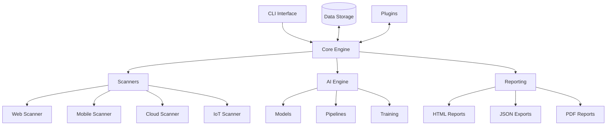

# VulnBuster Architecture

This document provides an overview of VulnBuster's architecture, design principles, and core components.

## 🏗️ High-Level Architecture



## 📦 Core Components

### 1. CLI Interface
- Entry point for all commands
- Handles argument parsing and command routing
- Manages output formatting

### 2. Core Engine
- Orchestrates scanning processes
- Manages plugin system
- Handles concurrency and resource management
- Implements the main execution pipeline

### 3. Scanners
#### Web Scanner
- Web application security testing
- API security testing
- Modern web framework support

#### Mobile Scanner
- Android and iOS application analysis
- Static and dynamic analysis
- Frida integration

#### Cloud Scanner
- Multi-cloud security assessment
- Infrastructure as Code (IaC) scanning
- Compliance checking

#### IoT Scanner
- Firmware analysis
- Protocol fuzzing
- Hardware security testing

### 4. AI Engine
- Machine learning models for security analysis
- Natural language processing
- Anomaly detection
- Automated remediation suggestions

### 5. Reporting
- Multiple output formats (HTML, JSON, PDF)
- Custom report templates
- Executive summaries
- Technical details

## 🔌 Plugin System

VulnBuster's plugin system allows extending functionality without modifying core code.

### Plugin Types
1. **Scanner Plugins** - Add new security checks
2. **Report Plugins** - Custom report formats
3. **AI Model Plugins** - Add custom ML models
4. **Integration Plugins** - Third-party integrations

### Plugin Structure
```python
from vulnbuster.plugins import ScannerPlugin

class CustomScanner(ScannerPlugin):
    name = "custom_scanner"
    description = "Custom security scanner"
    
    def scan(self, target):
        # Scanning logic here
        findings = []
        return findings
```

## 🔄 Data Flow

1. **Initialization**
   - Load configuration
   - Initialize plugins
   - Set up data storage

2. **Scanning**
   - Target discovery
   - Vulnerability detection
   - Data collection

3. **Analysis**
   - AI-powered analysis
   - False positive reduction
   - Risk scoring

4. **Reporting**
   - Generate reports
   - Export results
   - Notifications

## 🏗️ Design Patterns

### 1. Command Pattern
- Used for CLI commands
- Each command is a self-contained class
- Easy to add new commands

### 2. Plugin Pattern
- Extensible architecture
- Loose coupling between components
- Dynamic loading of features

### 3. Builder Pattern
- Complex object construction
- Report generation
- Scan configuration

### 4. Observer Pattern
- Event-driven architecture
- Real-time updates
- Progress reporting

## 🧠 AI/ML Integration

### Model Serving
- ONNX Runtime for inference
- TensorFlow/PyTorch support
- Custom model hosting

### Training Pipeline
1. Data collection
2. Preprocessing
3. Model training
4. Evaluation
5. Deployment

## 📊 Data Storage

### Structured Data
- SQLite (default)
- PostgreSQL (for large deployments)
- Schema versioning

### Unstructured Data
- File system storage
- Object storage (S3, GCS)
- Caching layer

## 🔒 Security Considerations

- Secure credential handling
- Input validation
- Output encoding
- Secure defaults
- Audit logging

## 🚀 Performance Optimization

### Caching
- Request/response caching
- Model inference caching
- Result caching

### Parallelism
- Multi-threading
- Asynchronous I/O
- Distributed scanning

### Resource Management
- Memory usage monitoring
- CPU utilization
- Network throttling

## 🔄 CI/CD Integration

### Testing
- Unit tests
- Integration tests
- Performance tests
- Security tests

### Deployment
- Docker containers
- Kubernetes manifests
- Terraform modules

## 📚 Related Documentation

- [API Reference](./api-reference.md)
- [Plugin Development](./plugin-development.md)
- [Testing Guide](./testing.md)
- [Deployment Guide](./deployment.md)
